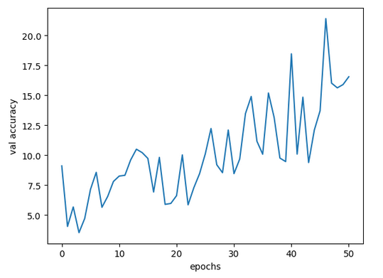
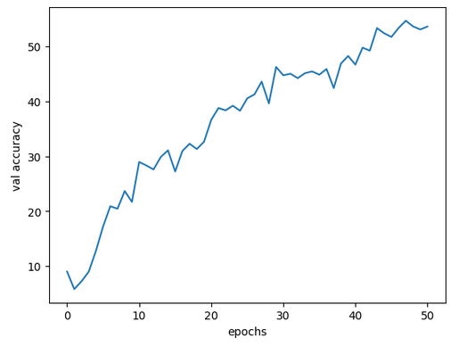
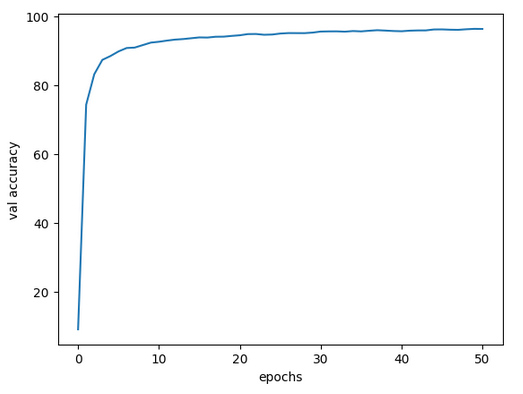
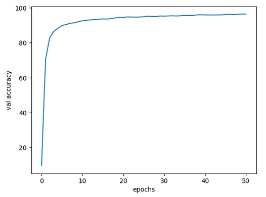

# Meta-Pseudo-Labels

The goal of this repository is to create an understandable and expandable PyTorch implementation of the Meta Pseudo Labels paper: https://arxiv.org/abs/2003.10580

This implementation is:
- correct (insofar as it is faithful to the paper)
- minimal
- readable
- easily runnable on cpu only hardware

Performance of the proposed approximation used by the authors (not in the paper) without the supervised or UDA loss terms:

Performance of the true MPL loss described in the paper without the supervised or UDA loss terms:

Performance of the proposed approximation used by the authors (not in the paper) with the supervised term but no UDA loss term:

Performance of the true MPL loss described in the paper with the supervised term but no UDA loss term:

